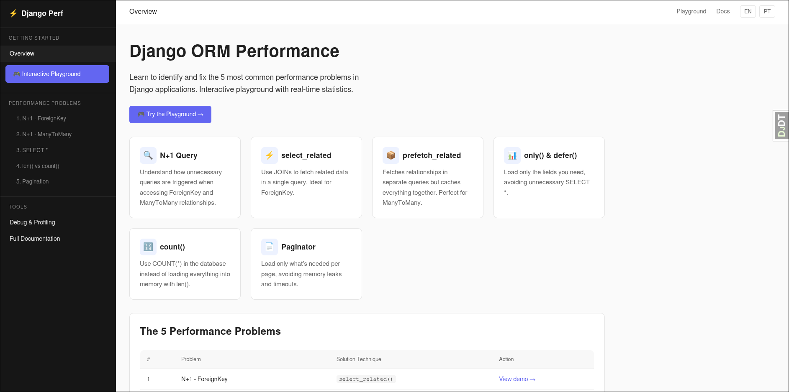

# Django Performance Demo



An interactive educational tool for teaching developers how to identify and solve the 5 most common performance problems in Django ORM applications.

**Access the playground:** `/playground/`

______________________________________________________________________

## The 5 Performance Problems Demonstrated

| # | Problem | Technique | Playground URL |
|---|---------|-----------|----------------|
| 1 | N+1 Query (ForeignKey) | `select_related()` | `/playground/` |
| 2 | N+1 Query (ManyToMany) | `prefetch_related()` | `/playground/` |
| 3 | SELECT * unnecessary | `only()` / `defer()` | `/playground/` |
| 4 | `len()` vs `count()` | `count()` | `/playground/` |
| 5 | Missing pagination | `Paginator` | `/playground/` |

______________________________________________________________________

## Problems Explained

### 1. N+1 Query - ForeignKey

**What is it?**
The N+1 problem occurs when you fetch a list of objects (1 query) and then access a related object (ForeignKey) for each one in a loop. This triggers N extra queries.

**Example:** With 50 books, accessing `book.author.name` triggers **51 queries** (1 for books + 50 for authors).

**Solution:** Use `select_related()` to do a SQL JOIN:

```python
# Slow: 51 queries
books = Book.objects.all()[:50]
for book in books:
    print(book.author.name)

# Fast: 1 query
books = Book.objects.select_related('author')[:50]
for book in books:
    print(book.author.name)
```

______________________________________________________________________

### 2. N+1 Query - ManyToMany

**What is it?**
Same as above, but with ManyToMany relationships. Each call to `.all()` triggers a new query.

**Solution:** Use `prefetch_related()`:

```python
# Slow: 51 queries minimum
books = Book.objects.all()[:50]
for book in books:
    for tag in book.tags.all():
        print(tag.name)

# Fast: 2 queries (independent of N)
books = Book.objects.prefetch_related('tags')[:50]
for book in books:
    for tag in book.tags.all():
        print(tag.name)
```

______________________________________________________________________

### 3. SELECT * Unnecessary

**What is it?**
Django loads ALL model fields by default. Even if you only use title, year, and price, fields like `synopsis` (TextField) are also loaded, wasting memory and bandwidth.

**Solution:** Use `only()` or `defer()`:

```python
# Slow: loads all fields including heavy ones
books = Book.objects.all()[:50]
for book in books:
    print(book.title)

# Fast: loads only needed fields
books = Book.objects.only('title', 'published_year', 'price')[:50]
```

______________________________________________________________________

### 4. len() vs count()

**What is it?**
Using `len()` on a QuerySet loads ALL objects into memory just to count them. The database can do this much more efficiently.

**Solution:** Use `.count()`:

```python
# Slow: loads all records into memory
books = Book.objects.all()
total = len(books)

# Fast: uses COUNT(*)
total = Book.objects.count()
```

______________________________________________________________________

### 5. Missing Pagination

**What is it?**
Loading all records at once overloads the database, memory, and the browser.

**Solution:** Use Django's Paginator:

```python
# Slow: loads all records
books = Book.objects.all()

# Fast: loads only current page
from django.core.paginator import Paginator
paginator = Paginator(Book.objects.all(), per_page=20)
page = paginator.get_page(request.GET.get('page', 1))
```

______________________________________________________________________

## Demo URLs

| Problem | Slow | Fast |
|----------|------|------|
| N+1 FK | `/books/slow/` | `/books/fast/` |
| N+1 M2M | `/tags/slow/` | `/tags/fast/` |
| SELECT * | `/fields/slow/` | `/fields/fast/` |
| len vs count | `/count/slow/` | `/count/fast/` |
| Pagination | `/paginate/slow/` | `/paginate/fast/` |

**Interactive:** `/playground/` | **Docs:** `/docs/`

______________________________________________________________________

## Quick Start

### Prerequisites

- Docker & Docker Compose

### Setup

```bash
# Start all services (PostgreSQL + Web)
docker compose up -d

# Run migrations
docker compose run --rm web python manage.py migrate

# Seed database with test data
docker compose run --rm web python manage.py seed
```

The application will be available at `http://localhost:8000`

______________________________________________________________________

## Commands

### Development

```bash
# Build and start
docker compose up --build -d

# View logs
docker compose logs -f web

# Stop services
docker compose down
```

### Database

```bash
# Run migrations
docker compose run --rm web python manage.py migrate

# Seed database
docker compose run --rm web python manage.py seed

# Access PostgreSQL
docker compose run --rm db psql -U perfuser -d perfdb

# Reset database
docker compose down -v
docker compose up -d
docker compose run --rm web python manage.py migrate
docker compose run --rm web python manage.py seed
```

### Tests

```bash
# Run all tests
docker compose --profile test run test

# Run specific test file
docker compose --profile test run test pytest store/tests/test_n_plus_one_fk.py

# Access container shell
docker compose --profile test run shell
```

______________________________________________________________________

## Debug Tools

- **Django Debug Toolbar:** `/__debug__/` - Inspect queries per request
- **Django Silk:** `/silk/` - Profiling dashboard with request history

______________________________________________________________________

## Project Structure

```
django-perf-demo/
├── config/
│   ├── settings.py
│   └── urls.py
├── store/
│   ├── models.py         # Author, Book, Tag, Review
│   ├── views.py          # All demos + playground API
│   ├── urls.py          # Routes
│   ├── tests/           # Pytest tests
│   ├── factories.py     # factory-boy for test data
│   ├── middleware.py   # QueryCountMiddleware
│   └── templates/store/
│       ├── playground.html  # Interactive interface
│       ├── docs.html        # Full documentation
│       └── *.html          # Demo templates
├── templates/
├── locale/              # Translations (pt-BR, en)
├── manage.py
├── pyproject.toml       # Project dependencies (uv)
├── Dockerfile
├── docker-compose.yml
└── .env.example
```

______________________________________________________________________

## Technology Stack

- **Django 5.x** - Web framework
- **PostgreSQL** - Database
- **uv** - Package manager
- **docker-compose** - Container orchestration
- **django-debug-toolbar** - SQL inspection
- **django-silk** - Request profiling
- **factory-boy** - Test data generation
- **Faker** - Fake data generation
